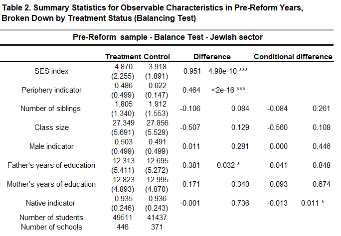
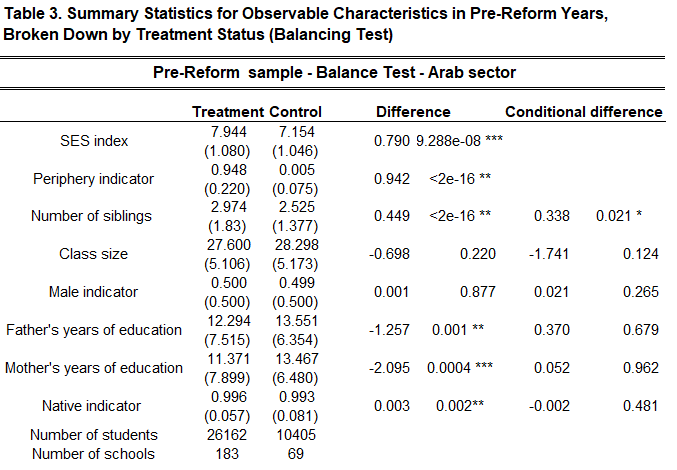
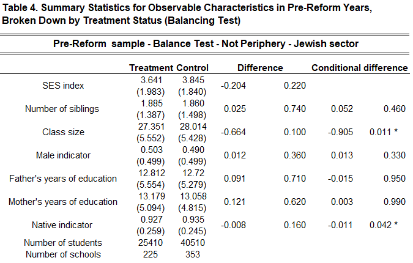

----


```{r echo=FALSE}
setwd("C:/Users/user/Documents/GitHub/rmarkdown-website-tutorial")
finald <- read.csv("finald.csv")
```


### Load R packages 

```{r include=FALSE}
library(sandwich)
library(lmtest)
library(stargazer)
library(estimatr)
library(texreg)
library(tidyverse)
library(plm)
library(lfe)
library(estimatr)
```


## Introduction
The panel data is clustered by 1069 schools. Schools were observed between 2008-2009, before the start of the program and in 2015-2016 after the end of the program. 


Schools were divided into sectors as follows:
```{r echo=FALSE}
table(finald$CODE_MIGZAR)
```
"0" - Jewish sector
"1" _ Arabic sector


Schools were divided by years and sectors as follows:
```{r echo=FALSE}
table(finald$CODE_MIGZAR, finald$SHNAT_LIMUD)
```

Schools were divided by treatment as follows:
```{r echo=FALSE}
table(finald$treat)
```


```{r echo=FALSE}
str(finald)
```

# Number of schools observed in the 2 periods - Before and after the treatment  
```{r echo=FALSE}
length(unique(finald$CODE_MOSAD))
```

## Balancing test for general sample 


<br> 


# Anlalysis by sectors - Jewish("0") vs Arab("1") 

## Balancing test general sample 



<br> 



<br> 


### Obsevations by sectores table 
```{r echo=FALSE}
table(finald$CODE_MIGZAR)
```

**section 1 -  Full sample analysis**

### Split the data by sectores
```{r echo=FALSE}
final_df_jew <- finald %>%
  filter(CODE_MIGZAR == "0") 
final_df_arb <- finald %>%
  filter(CODE_MIGZAR == "1") 
```


## DiD regression with clustered SE - Jewish sector
```{r echo=FALSE}
didreg.heb.jew <- lm_robust(heb.zscore ~ treat + after + did,
                        data = final_df_jew, clusters = CODE_MOSAD, se_type = "stata")
didreg.mat.jew <- lm_robust(mat.zscore ~ treat + after + did,
                        data = final_df_jew, clusters = CODE_MOSAD, se_type = "stata")
didreg.eng.jew <- lm_robust(eng.zscore ~ treat + after + did,
                        data = final_df_jew, clusters = CODE_MOSAD, se_type = "stata")
```


## DiD regression with clustered SE - Arab sector
```{r echo=FALSE}
didreg.arb.arb <- lm_robust(arb.zscore ~ treat + after + did,
                            data = final_df_arb, clusters = CODE_MOSAD, se_type = "stata")
didreg.mat.arb <- lm_robust(mat.zscore ~ treat + after + did,
                            data = final_df_arb, clusters = CODE_MOSAD, se_type = "stata")
didreg.eng.arb <- lm_robust(eng.zscore ~ treat + after + did,
                            data = final_df_arb, clusters = CODE_MOSAD, se_type = "stata")
```


Combined sector General DiD results
```{r echo=FALSE}
screenreg(list(didreg.heb.jew, didreg.mat.jew, didreg.eng.jew, didreg.arb.arb, didreg.mat.arb, didreg.eng.arb),
          custom.header = list("Jewish sector" = 1:3,  "Arab sector" = 4:6), include.ci = F, stars = c(.1, .05, .01), 
          digits = 3, custom.model.names = c("Hebrew", "Math", "English", "Arabic", "Math", "English"))
```


## DiD regression with clustered SE + Fixed effects - Jewish sector
```{r include=FALSE}
didreg.heb.jew.fe <- lm_robust(heb.zscore ~ did, fixed_effects = ~CODE_MOSAD+SHNAT_LIMUD,
                            data = final_df_jew, clusters = CODE_MOSAD, se_type = "stata")
didreg.mat.jew.fe <- lm_robust(mat.zscore ~  did,fixed_effects = ~CODE_MOSAD+SHNAT_LIMUD,
                            data = final_df_jew, clusters = CODE_MOSAD, se_type = "stata")
didreg.eng.jew.fe <- lm_robust(eng.zscore ~  did,fixed_effects = ~CODE_MOSAD+SHNAT_LIMUD,
                            data = final_df_jew, clusters = CODE_MOSAD, se_type = "stata")
```


## DiD regression with clustered SE + Fixed effects - Arabic sector
```{r include=FALSE}
didreg.arb.arb.fe <- lm_robust(arb.zscore ~ did,fixed_effects = ~CODE_MOSAD+SHNAT_LIMUD,
                            data = final_df_arb, clusters = CODE_MOSAD, se_type = "stata")
didreg.mat.arb.fe <- lm_robust(mat.zscore ~  did,fixed_effects = ~CODE_MOSAD+SHNAT_LIMUD,
                            data = final_df_arb, clusters = CODE_MOSAD, se_type = "stata")
didreg.eng.arb.fe <- lm_robust(eng.zscore ~  did,fixed_effects = ~CODE_MOSAD+SHNAT_LIMUD,
                            data = final_df_arb, clusters = CODE_MOSAD, se_type = "stata")
```


Combined sector General DiD results + Fixed effects 
```{r echo=FALSE}
screenreg(list(didreg.heb.jew.fe, didreg.mat.jew.fe, didreg.eng.jew.fe, didreg.arb.arb.fe, didreg.mat.arb.fe, didreg.eng.arb.fe),
          custom.header = list("Jewish sector" = 1:3,  "Arab sector" = 4:6), include.ci = F, stars = c(.1, .05, .01), 
          digits = 3, custom.model.names = c("Hebrew", "Math", "English", "Arabic", "Math", "English"))
```


## DiD regression with clustered SE + Fixed effects + additional variables - Jewish sector
```{r echo=FALSE}
didreg.heb.fe.var.jew <- lm_robust(heb.zscore ~  did + CODE_MIN + SHNOT_LIMUD_AV + SHNOT_LIMUD_EM + dummy_av_88 + 
                                 dummy_em_88 + mean_kids_per_class_by_school_year + erets_leda_ISR + MISPAR_ACHIM + SES_index, fixed_effects = ~CODE_MOSAD+SHNAT_LIMUD,
                               data = final_df_jew, clusters = CODE_MOSAD, se_type = "stata", try_cholesky = TRUE)
didreg.mat.fe.var.jew <- lm_robust(mat.zscore ~ did + CODE_MIN + SHNOT_LIMUD_AV + SHNOT_LIMUD_EM + dummy_av_88 + 
                                 dummy_em_88 + mean_kids_per_class_by_school_year + erets_leda_ISR + MISPAR_ACHIM + SES_index, fixed_effects = ~CODE_MOSAD+SHNAT_LIMUD,
                               data = final_df_jew, clusters = CODE_MOSAD, se_type = "stata", try_cholesky = TRUE)
didreg.eng.fe.var.jew <- lm_robust(eng.zscore ~  did + CODE_MIN + SHNOT_LIMUD_AV + SHNOT_LIMUD_EM + dummy_av_88 + 
                                 dummy_em_88 + mean_kids_per_class_by_school_year + erets_leda_ISR + MISPAR_ACHIM + SES_index, fixed_effects = ~CODE_MOSAD+SHNAT_LIMUD,
                               data = final_df_jew, clusters = CODE_MOSAD, se_type = "stata", try_cholesky = TRUE)

```


## DiD regression with clustered SE + Fixed effects + additional variables - Arabic sector
```{r include=FALSE}
didreg.arb.fe.var.arb <- lm_robust(arb.zscore ~  did + CODE_MIN + SHNOT_LIMUD_AV + SHNOT_LIMUD_EM + dummy_av_88 + 
                                     dummy_em_88 + mean_kids_per_class_by_school_year + erets_leda_ISR+ MISPAR_ACHIM + SES_index, fixed_effects = ~CODE_MOSAD+SHNAT_LIMUD,
                                   data = final_df_arb, clusters = CODE_MOSAD, se_type = "stata", try_cholesky = TRUE)
didreg.mat.fe.var.arb <- lm_robust(mat.zscore ~ did + CODE_MIN + SHNOT_LIMUD_AV + SHNOT_LIMUD_EM + dummy_av_88 + 
                                     dummy_em_88 + mean_kids_per_class_by_school_year + erets_leda_ISR + MISPAR_ACHIM + SES_index,fixed_effects = ~CODE_MOSAD+SHNAT_LIMUD,
                                   data = final_df_arb, clusters = CODE_MOSAD, se_type = "stata", try_cholesky = TRUE)
didreg.eng.fe.var.arb <- lm_robust(eng.zscore ~  did + CODE_MIN + SHNOT_LIMUD_AV + SHNOT_LIMUD_EM + dummy_av_88 + 
                                     dummy_em_88 + mean_kids_per_class_by_school_year + erets_leda_ISR + MISPAR_ACHIM + SES_index, fixed_effects = ~CODE_MOSAD+SHNAT_LIMUD,
                                   data = final_df_arb, clusters = CODE_MOSAD, se_type = "stata", try_cholesky = TRUE)

```


Combined sector General DiD results + Fixed effects 
```{r echo=FALSE}
screenreg(list(didreg.heb.fe.var.jew, didreg.mat.fe.var.jew, didreg.eng.fe.var.jew, didreg.arb.fe.var.arb, didreg.mat.fe.var.arb, didreg.eng.fe.var.arb),
          custom.header = list("Jewish sector" = 1:3,  "Arab sector" = 4:6), include.ci = F, stars = c(.1, .05, .01),
          custom.coef.map = list("did" = "Diff-in-Diff", "CODE_MIN" = "Sex", "SHNOT_LIMUD_AV" = "Father's years of education",
                                 "SHNOT_LIMUD_EM" = "Mother's years of education","erets_leda_ISR" = "Native indicator",
                                 "MISPAR_ACHIM" = "Number of siblings" ,"SES_index" = "SES index",
                                  "mean_kids_per_class_by_school_year" = "Class size"),
          digits = 3, custom.model.names = c("Hebrew", "Math", "English", "Arabic", "Math", "English"))
```


**section 2 -  periphery vs rest**

Because almost all observation in the north and south regions took part in the program, I will check only the difference in the 
other regions. 



<br> 


### Split the data by regions periphery ("0") and rest ("1") 
```{r echo=FALSE}
final.df_periphery <- finald %>%
  filter(mahoz_ind == "1")
final.df_rest <- finald %>%
  filter(mahoz_ind == "0")
```


### Split final.df_rest by sector
```{r echo=FALSE}
final.df_rest.jew <- final.df_rest %>%
  filter(CODE_MIGZAR == "0")
final.df_rest.arb <- final.df_rest %>%
  filter(CODE_MIGZAR == "1")
```


### Table of observations per region 
```{r echo=FALSE}
region_tbl <- table(finald$mahoz_ind)
names(region_tbl)[1]<-paste("Periphery")
names(region_tbl)[2]<-paste("Rest")
region_tbl

```

### Table of observations per region per sector 
```{r echo=FALSE}
region_sectore_table <- table(finald$mahoz_ind, finald$CODE_MIGZAR)
rownames(region_sectore_table) <- c("Periphery", "Rest" )
colnames(region_sectore_table) <- c("Jewish", "Arab" )
region_sectore_table
```

# Simple DiD regression on rest regions by sectores 

### DiD regression with clustered SE - rest regions - Jewish sector only
```{r echo=FALSE}
didreg.heb.jew.rest <- lm_robust(heb.zscore ~ treat + after + did,
                        data = final.df_rest.jew, clusters = CODE_MOSAD, se_type = "stata")
didreg.mat.jew.rest <- lm_robust(mat.zscore ~ treat + after + did,
                        data = final.df_rest.jew, clusters = CODE_MOSAD, se_type = "stata")
didreg.eng.jew.rest <- lm_robust(eng.zscore ~ treat + after + did,
                        data = final.df_rest.jew, clusters = CODE_MOSAD, se_type = "stata")
```


## DiD regression with clustered SE - rest regions - Arab sector only
```{r echo=FALSE}
didreg.arb.arb.rest <- lm_robust(arb.zscore ~ treat + after + did,
                        data = final.df_rest.arb, clusters = CODE_MOSAD, se_type = "stata")
didreg.mat.arb.rest <- lm_robust(mat.zscore ~ treat + after + did,
                        data = final.df_rest.arb, clusters = CODE_MOSAD, se_type = "stata")
didreg.eng.arb.rest <- lm_robust(eng.zscore ~ treat + after + did,
                        data = final.df_rest.arb, clusters = CODE_MOSAD, se_type = "stata")
```


Combined sector General DiD results - Rest of israel by sectors 
```{r echo=FALSE}
screenreg(list(didreg.heb.jew.rest, didreg.mat.jew.rest, didreg.eng.jew.rest, didreg.arb.arb.rest, didreg.mat.arb.rest, didreg.eng.arb.rest),
          custom.header = list("Jewish sector" = 1:3,  "Arab sector" = 4:6), include.ci = F, stars = c(.1, .05, .01), 
          digits = 3, custom.model.names = c("Hebrew", "Math", "English", "Arabic", "Math", "English"))
```

# DiD regression with clustered SE + Fixed effects

## DiD regression with clustered SE + Fixed effects - Jewish sector
```{r include=FALSE}
didreg.heb.rest.jew.fe <- lm_robust(heb.zscore ~  did, fixed_effects = ~CODE_MOSAD+SHNAT_LIMUD,
                            data = final.df_rest.jew, clusters = CODE_MOSAD, se_type = "stata")
didreg.mat.rest.jew.fe <- lm_robust(mat.zscore ~  did,fixed_effects = ~CODE_MOSAD+SHNAT_LIMUD,
                            data = final.df_rest.jew, clusters = CODE_MOSAD, se_type = "stata")
didreg.eng.rest.jew.fe <- lm_robust(eng.zscore ~  did,fixed_effects = ~CODE_MOSAD+SHNAT_LIMUD,
                            data = final.df_rest.jew, clusters = CODE_MOSAD, se_type = "stata")
```


## DiD regression with clustered SE + Fixed effects - Arab sector
```{r include=FALSE}
didreg.arb.rest.arb.fe <- lm_robust(arb.zscore ~  did, fixed_effects = ~CODE_MOSAD+SHNAT_LIMUD,
                            data = final.df_rest.arb, clusters = CODE_MOSAD, se_type = "stata")
didreg.mat.rest.arb.fe <- lm_robust(mat.zscore ~  did,fixed_effects = ~CODE_MOSAD+SHNAT_LIMUD,
                            data = final.df_rest.arb, clusters = CODE_MOSAD, se_type = "stata")
didreg.eng.rest.arb.fe <- lm_robust(eng.zscore ~  did,fixed_effects = ~CODE_MOSAD+SHNAT_LIMUD,
                            data = final.df_rest.arb, clusters = CODE_MOSAD, se_type = "stata")
```


Combined sector General DiD results + Fixed effects - Rest of israel by sectors 
```{r echo=FALSE}
screenreg(list(didreg.heb.rest.jew.fe, didreg.mat.rest.jew.fe, didreg.eng.rest.jew.fe, didreg.arb.rest.arb.fe, didreg.mat.rest.arb.fe, didreg.eng.rest.arb.fe),
          custom.header = list("Jewish sector" = 1:3,  "Arab sector" = 4:6), include.ci = F, stars = c(.1, .05, .01), 
          digits = 3, custom.model.names = c("Hebrew", "Math", "English", "Arabic", "Math", "English"))
```


# DiD regression with clustered SE + Fixed effects + additional variables 


## DiD regression with clustered SE + Fixed effects + additional variables - Jewish sector
```{r include=FALSE}
didreg.heb.fe.var.jew.rest <- lm_robust(heb.zscore ~  did + CODE_MIN + SHNOT_LIMUD_AV + SHNOT_LIMUD_EM + dummy_av_88 + 
                                 dummy_em_88 + mean_kids_per_class_by_school_year + erets_leda_ISR + MISPAR_ACHIM + SES_index, fixed_effects = ~CODE_MOSAD+SHNAT_LIMUD,
                               data = final.df_rest.jew, clusters = CODE_MOSAD, se_type = "stata", try_cholesky = TRUE)
didreg.mat.fe.var.jew.rest <- lm_robust(mat.zscore ~ did + CODE_MIN + SHNOT_LIMUD_AV + SHNOT_LIMUD_EM + dummy_av_88 + 
                                 dummy_em_88 + mean_kids_per_class_by_school_year + erets_leda_ISR  + MISPAR_ACHIM + SES_index, fixed_effects = ~CODE_MOSAD+SHNAT_LIMUD,
                               data = final.df_rest.jew, clusters = CODE_MOSAD, se_type = "stata", try_cholesky = TRUE)
didreg.eng.fe.var.jew.rest <- lm_robust(eng.zscore ~  did + CODE_MIN + SHNOT_LIMUD_AV + SHNOT_LIMUD_EM + dummy_av_88 + 
                                 dummy_em_88 + mean_kids_per_class_by_school_year + erets_leda_ISR  + MISPAR_ACHIM + SES_index, fixed_effects = ~CODE_MOSAD+SHNAT_LIMUD,
                               data = final.df_rest.jew, clusters = CODE_MOSAD, se_type = "stata", try_cholesky = TRUE)

```


## DiD regression with clustered SE + Fixed effects + additional variables - Arab sector
```{r include=FALSE}
didreg.arb.fe.var.arb.rest <- lm_robust(arb.zscore ~  did + CODE_MIN + SHNOT_LIMUD_AV + SHNOT_LIMUD_EM + dummy_av_88 + 
                                 dummy_em_88 + mean_kids_per_class_by_school_year + erets_leda_ISR  + MISPAR_ACHIM + SES_index, fixed_effects = ~CODE_MOSAD+SHNAT_LIMUD,
                               data = final.df_rest.arb, clusters = CODE_MOSAD, se_type = "stata", try_cholesky = TRUE)
didreg.mat.fe.var.arb.rest <- lm_robust(mat.zscore ~ did + CODE_MIN + SHNOT_LIMUD_AV + SHNOT_LIMUD_EM + dummy_av_88 + 
                                 dummy_em_88 + mean_kids_per_class_by_school_year + erets_leda_ISR + MISPAR_ACHIM + SES_index, fixed_effects = ~CODE_MOSAD+SHNAT_LIMUD,
                               data = final.df_rest.arb, clusters = CODE_MOSAD, se_type = "stata", try_cholesky = TRUE)
didreg.eng.fe.var.arb.rest <- lm_robust(eng.zscore ~  did + CODE_MIN + SHNOT_LIMUD_AV + SHNOT_LIMUD_EM + dummy_av_88 + 
                                 dummy_em_88 + mean_kids_per_class_by_school_year + erets_leda_ISR + MISPAR_ACHIM + SES_index, fixed_effects = ~CODE_MOSAD+SHNAT_LIMUD,
                               data = final.df_rest.arb, clusters = CODE_MOSAD, se_type = "stata", try_cholesky = TRUE)

```


Combined sector General DiD results + Fixed effects + Aditional vars - Rest of israel by sectors 
```{r echo=FALSE}
screenreg(list(didreg.heb.fe.var.jew.rest, didreg.mat.fe.var.jew.rest, didreg.eng.fe.var.jew.rest, didreg.arb.fe.var.arb.rest, didreg.mat.fe.var.arb.rest, didreg.eng.fe.var.arb.rest),
          custom.coef.map = list("did" = "Diff-in-Diff", "CODE_MIN" = "Sex", "SHNOT_LIMUD_AV" = "Father's years of education",
                                 "SHNOT_LIMUD_EM" = "Mother's years of education","erets_leda_ISR" = "Native indicator",
                                 "MISPAR_ACHIM" = "Number of siblings" ,"SES_index" = "SES index",
                                  "mean_kids_per_class_by_school_year" = "Class size"),
          custom.header = list("Jewish sector" = 1:3,  "Arab sector" = 4:6), include.ci = F, stars = c(.1, .05, .01), 
          digits = 3, custom.model.names = c("Hebrew", "Math", "English", "Arabic", "Math", "English"))

```


**Section 3 -  SES index analysis**

Split by sectors 
```{r include=FALSE}

finald_jew <- finald %>% 
  filter(CODE_MIGZAR == "0")

finald_arb <- finald %>% 
  filter(CODE_MIGZAR == "1")

```

Creat dummy variables for SES index
```{r}

finald_jew$dummy_up <- ifelse(finald_jew$SES_index <= 4, "1", "0")
finald_jew$dummy_mid <- ifelse(finald_jew$SES_index > 4 & finald_jew$SES_index <= 7, "1", "0")
finald_jew$dummy_low <- ifelse(finald_jew$SES_index > 7, "1", "0")

finald_arb$dummy_up <- ifelse(finald_arb$SES_index <= 4, "1", "0")
finald_arb$dummy_mid <- ifelse(finald_arb$SES_index > 4 & finald_arb$SES_index <= 7, "1", "0")
finald_arb$dummy_low <- ifelse(finald_arb$SES_index > 7, "1", "0")

```

# Hebrew 

Jewish sector
```{r echo=FALSE}

didreg.heb.jew.ses <- lm_robust(heb.zscore ~ did + treat + after + dummy_mid + dummy_low + treat*dummy_mid + treat*dummy_low + 
                                after*dummy_mid + after*dummy_low + did*dummy_mid + did*dummy_low,
                                data = finald_jew, clusters = CODE_MOSAD, se_type = "stata")

didreg.heb.jew.fe.ses <- lm_robust(heb.zscore ~ did + dummy_mid + dummy_low + did*dummy_mid + did*dummy_low, fixed_effects = ~CODE_MOSAD+SHNAT_LIMUD, 
                                data = finald_jew, clusters = CODE_MOSAD, se_type = "stata")

didreg.heb.jew.fe.vars.ses <- lm_robust(heb.zscore ~ did + dummy_mid + dummy_low + did*dummy_mid + did*dummy_low + CODE_MIN +
                                        SHNOT_LIMUD_EM + SHNOT_LIMUD_AV + MISPAR_ACHIM + erets_leda_ISR + mean_kids_per_class_by_school_year + 
                                        dummy_av_88 + dummy_em_88,
                                        fixed_effects = ~CODE_MOSAD+SHNAT_LIMUD, 
                                        data = finald_jew, clusters = CODE_MOSAD, se_type = "stata")
```

Arab sector
```{r echo=FALSE}
didreg.arb.arb.ses <- lm_robust(arb.zscore ~ did + treat + after + dummy_low + treat*dummy_low + 
                                after*dummy_low + did*dummy_low,
                                data = finald_arb, clusters = CODE_MOSAD, se_type = "stata")

didreg.arb.arb.fe.ses <- lm_robust(arb.zscore ~ did + dummy_low + did*dummy_low, fixed_effects = ~CODE_MOSAD+SHNAT_LIMUD,
                                   data = finald_arb, clusters = CODE_MOSAD, se_type = "stata")

didreg.arb.arb.fe.vars.ses <- lm_robust(arb.zscore ~ did + dummy_low + did*dummy_low + CODE_MIN +
                                        SHNOT_LIMUD_EM + SHNOT_LIMUD_AV + MISPAR_ACHIM + erets_leda_ISR + mean_kids_per_class_by_school_year + 
                                        dummy_av_88 + dummy_em_88, 
                                        fixed_effects = ~CODE_MOSAD+SHNAT_LIMUD, 
                                        data = finald_arb, clusters = CODE_MOSAD, se_type = "stata")
```

```{r echo=FALSE}

screenreg(list(didreg.heb.jew.ses, didreg.heb.jew.fe.ses, didreg.heb.jew.fe.vars.ses, didreg.arb.arb.ses, didreg.arb.arb.fe.ses, didreg.arb.arb.fe.vars.ses),
          custom.coef.names = c("Intercept", "Reform DiD", "Treat", "After", "Middle SES index", "Low SES index", "Treat*Middle SES index", "Treat*Low SES index", "After*Middle SES index", "After*Low SES index", "Middle SES index*Reform DiD", "Low SES index*Reform DiD", "Male indicator", "Mother's years of education", "Father's years of education", "Number of siblings", "Native indicator", "Class size", "Dummy father 88", "Dummy Mother 88"),
          custom.header = list("Jewish" = 1:3, "Arab" = 4:6), include.ci = F, stars = c(.1, .05, .01),
          digits = 3, custom.model.names = c("Model 1", "Model 2", "Model 3","Model 1", "Model 2", "Model 3"))
```

# English  

Jewish sector
```{r echo=FALSE}

didreg.english.jew.ses <- lm_robust(eng.zscore ~ did + treat + after + dummy_mid + dummy_low + treat*dummy_mid + treat*dummy_low + 
                                after*dummy_mid + after*dummy_low + did*dummy_mid + did*dummy_low,
                                data = finald_jew, clusters = CODE_MOSAD, se_type = "stata")

didreg.english.jew.fe.ses <- lm_robust(eng.zscore ~ did + dummy_mid + dummy_low + did*dummy_mid + did*dummy_low, fixed_effects = ~CODE_MOSAD+SHNAT_LIMUD, 
                                data = finald_jew, clusters = CODE_MOSAD, se_type = "stata")

didreg.english.jew.fe.vars.ses <- lm_robust(eng.zscore ~ did + dummy_mid + dummy_low + did*dummy_mid + did*dummy_low + CODE_MIN +
                                        SHNOT_LIMUD_EM + SHNOT_LIMUD_AV + MISPAR_ACHIM + erets_leda_ISR + mean_kids_per_class_by_school_year + 
                                        dummy_av_88 + dummy_em_88,
                                        fixed_effects = ~CODE_MOSAD+SHNAT_LIMUD, 
                                        data = finald_jew, clusters = CODE_MOSAD, se_type = "stata")
```

Arab sector
```{r echo=FALSE}
didreg.english.arb.ses <- lm_robust(eng.zscore ~ did + treat + after + dummy_low + treat*dummy_low + 
                                after*dummy_low + did*dummy_low,
                                data = finald_arb, clusters = CODE_MOSAD, se_type = "stata")

didreg.english.arb.fe.ses <- lm_robust(eng.zscore ~ did + dummy_low + did*dummy_low, fixed_effects = ~CODE_MOSAD+SHNAT_LIMUD,
                                   data = finald_arb, clusters = CODE_MOSAD, se_type = "stata")

didreg.english.arb.fe.vars.ses <- lm_robust(eng.zscore ~ did + dummy_low + did*dummy_low + CODE_MIN +
                                        SHNOT_LIMUD_EM + SHNOT_LIMUD_AV + MISPAR_ACHIM + erets_leda_ISR + mean_kids_per_class_by_school_year + 
                                        dummy_av_88 + dummy_em_88, 
                                        fixed_effects = ~CODE_MOSAD+SHNAT_LIMUD, 
                                        data = finald_arb, clusters = CODE_MOSAD, se_type = "stata")
```

```{r echo=FALSE}

screenreg(list(didreg.english.jew.ses, didreg.english.jew.fe.ses, didreg.english.jew.fe.vars.ses, didreg.english.arb.ses, didreg.english.arb.fe.ses, didreg.english.arb.fe.vars.ses),
          custom.coef.names = c("Intercept", "Reform DiD", "Treat", "After", "Middle SES index", "Low SES index", "Treat*Middle SES index", "Treat*Low SES index", "After*Middle SES index", "After*Low SES index", "Middle SES index*Reform DiD", "Low SES index*Reform DiD", "Male indicator", "Mother's years of education", "Father's years of education", "Number of siblings", "Native indicator", "Class size", "Dummy father 88", "Dummy Mother 88"),
          custom.header = list("Jewish" = 1:3, "Arab" = 4:6), include.ci = F, stars = c(.1, .05, .01),
          digits = 3, custom.model.names = c("Model 1", "Model 2", "Model 3","Model 1", "Model 2", "Model 3"))
```

# Math 

Jewish sector
```{r echo=FALSE}

didreg.math.jew.ses <- lm_robust(mat.zscore ~ did + treat + after + dummy_mid + dummy_low + treat*dummy_mid + treat*dummy_low + 
                                after*dummy_mid + after*dummy_low + did*dummy_mid + did*dummy_low,
                                data = finald_jew, clusters = CODE_MOSAD, se_type = "stata")

didreg.math.jew.fe.ses <- lm_robust(mat.zscore ~ did + dummy_mid + dummy_low + did*dummy_mid + did*dummy_low, fixed_effects = ~CODE_MOSAD+SHNAT_LIMUD, 
                                data = finald_jew, clusters = CODE_MOSAD, se_type = "stata")

didreg.math.jew.fe.vars.ses <- lm_robust(mat.zscore ~ did + dummy_mid + dummy_low + did*dummy_mid + did*dummy_low + CODE_MIN +
                                        SHNOT_LIMUD_EM + SHNOT_LIMUD_AV + MISPAR_ACHIM + erets_leda_ISR + mean_kids_per_class_by_school_year + 
                                        dummy_av_88 + dummy_em_88,
                                        fixed_effects = ~CODE_MOSAD+SHNAT_LIMUD, 
                                        data = finald_jew, clusters = CODE_MOSAD, se_type = "stata")
```

Arab sector
```{r echo=FALSE}
didreg.math.arb.ses <- lm_robust(mat.zscore ~ did + treat + after + dummy_low + treat*dummy_low + 
                                after*dummy_low + did*dummy_low,
                                data = finald_arb, clusters = CODE_MOSAD, se_type = "stata")

didreg.math.arb.fe.ses <- lm_robust(mat.zscore ~ did + dummy_low + did*dummy_low, fixed_effects = ~CODE_MOSAD+SHNAT_LIMUD,
                                   data = finald_arb, clusters = CODE_MOSAD, se_type = "stata")

didreg.math.arb.fe.vars.ses <- lm_robust(mat.zscore ~ did + dummy_low + did*dummy_low + CODE_MIN +
                                        SHNOT_LIMUD_EM + SHNOT_LIMUD_AV + MISPAR_ACHIM + erets_leda_ISR + mean_kids_per_class_by_school_year + 
                                        dummy_av_88 + dummy_em_88, 
                                        fixed_effects = ~CODE_MOSAD+SHNAT_LIMUD, 
                                        data = finald_arb, clusters = CODE_MOSAD, se_type = "stata")
```

```{r echo=FALSE}

screenreg(list(didreg.math.jew.ses, didreg.math.jew.fe.ses, didreg.math.jew.fe.vars.ses, didreg.math.arb.ses, didreg.math.arb.fe.ses, didreg.math.arb.fe.vars.ses),
          custom.coef.names = c("Intercept", "Reform DiD", "Treat", "After", "Middle SES index", "Low SES index", "Treat*Middle SES index", "Treat*Low SES index", "After*Middle SES index", "After*Low SES index", "Middle SES index*Reform DiD", "Low SES index*Reform DiD", "Male indicator", "Mother's years of education", "Father's years of education", "Number of siblings", "Native indicator", "Class size", "Dummy father 88", "Dummy Mother 88"),
          custom.header = list("Jewish" = 1:3, "Arab" = 4:6), include.ci = F, stars = c(.1, .05, .01),
          digits = 3, custom.model.names = c("Model 1", "Model 2", "Model 3","Model 1", "Model 2", "Model 3"))
```


